# Context Exploration Engine — Architecture

```mermaid
flowchart TD

    subgraph AGENTS["Agent Layer"]
        A1["Agent A"]
        A2["Agent B"]
        AN["Agent N"]
    end

    subgraph FLASK["Flask Bridge — context-visualizer (Python)"]

        subgraph PIPE["llm_dispatch.py · Request Pipeline"]
            SESSRES["Session Resolver<br/>conversation fingerprinting<br/>alice → alice.2, alice.3, …"]
            REPINJ["Replay Injector<br/>one-shot: error desc + failed messages<br/>injected into system prompt"]
            RECINJ["Recovery Injector<br/>pending recovery events<br/>injected as system prompt preamble"]
            IPC["IPC Bridge<br/>pool_stats://800.0:local:forward<br/>chimaera_client.forward_llm_request()"]
            SIGEX["Signal Extractor<br/>&lt;recovery_signal&gt; XML tags stripped<br/>from LLM response body"]
            AUTOCK["Auto-Checkpoint Thread<br/>background · 150 ms delay<br/>get_latest_sequence_id → detect_and_create"]
        end

        subgraph CKSYS["Checkpoint System — checkpoint_manager.py"]
            MGR["CheckpointManager<br/>singleton · thread-safe · file-backed"]
            SCR["Scoring Engine<br/>type_base + token_comp + latency_comp<br/>range 5 – 15"]
            PLN["Rollback Plan Builder<br/>fetches failed messages from CTE<br/>walks recovery event graph<br/>finds best restore per affected session"]
            RRP["Replay Registry<br/>_pending_replays dict<br/>one-shot: consumed on next request"]
        end

    end

    subgraph CHIM["Chimaera Runtime — C++"]

        subgraph PROXM["Proxy ChiMod · dt_proxy_runtime · pool 800.0"]
            FWDH["Forward Handler<br/>ForwardDirect() on I/O worker<br/>HTTP/HTTPS to upstream LLM<br/>measures latency"]
            SETH["Session Handlers<br/>list_sessions<br/>query_session<br/>get_interaction"]
            REVH["Recovery Handlers<br/>store_recovery_event<br/>query_recovery_events<br/>ack_recovery_event"]
        end

        subgraph TRKM["Tracker ChiMod · dt_tracker_runtime"]
            IREC["InteractionRecord<br/>sequence_id (monotonic counter)<br/>request body · response body<br/>tokens · latency · timestamp"]
            CONVT["Conversation Threader<br/>resolves parent_sequence_id<br/>links multi-turn conversation turns"]
            FDET["Failure Detector<br/>HTTP 4xx / 5xx status codes<br/>stop_reason = error / max_tokens<br/>context_exhausted signal<br/>emits recovery events with<br/>suggest_restore_to_sequence"]
        end

        subgraph UNTM["Context Untangler · dt_ctx_untangler_runtime"]
            CDIFF["ComputeDiff<br/>reads InteractionRecord from CTE<br/>computes context delta (diff node)<br/>stores to Ctx_graph_&lt;id&gt;"]
            GQRY["Graph Queries<br/>list_graphs · query_graph<br/>get_node (by seq_id)"]
        end

        subgraph INTR["Provider Interceptors"]
            IANT["Anthropic · dt_intercept_anthropic<br/>stream reassembly (SSE)<br/>cost estimation<br/>tool_use / end_turn parsing"]
            IOAI["OpenAI · dt_intercept_openai<br/>tool_calls parsing<br/>finish_reason detection"]
            IOLL["Ollama · dt_intercept_ollama<br/>native JSON format<br/>done flag detection"]
        end

    end

    subgraph LLMP["LLM Providers"]
        ANTH["Anthropic API<br/>api.anthropic.com"]
        OAPI["OpenAI API<br/>api.openai.com"]
        OLLA["Ollama<br/>localhost:11434"]
    end

    subgraph STORE["CTE Blob Storage — Chimaera"]
        SAGI["Agentic_session_&lt;id&gt;<br/>one blob per interaction<br/>blob name = zero-padded seq_id<br/>value = InteractionRecord JSON"]
        SREC["Recovery_&lt;id&gt;<br/>one blob per recovery event<br/>blob name = event UUID<br/>value = event JSON (+ acknowledged flag)"]
        SGPH["Ctx_graph_&lt;id&gt;<br/>one blob per context diff node<br/>blob name = zero-padded seq_id<br/>value = diff JSON"]
    end

    subgraph FSTORE["Persistent File Storage"]
        FJSON["~/.dt_provenance/checkpoints.json<br/>checkpoint metadata per session<br/>sequence_id · type · score<br/>token_count · latency_ms<br/>atomic tmpfile+rename writes"]
    end

    subgraph MCPSYS["MCP API Sub-System"]
        MCPGW["MCP Gateway<br/>HTTP server + SSE transport<br/>JSON-RPC 2.0 · MCP protocol"]
        subgraph MCHIPS["MChips"]
            MCTE["CTE MChip<br/>blob read / write via MCP tools"]
            MCAE["CAE MChip<br/>context-aware execution"]
            MCL["Cluster MChip<br/>distributed node queries"]
        end
    end

    subgraph DASH["Dashboard & REST API — Flask blueprints"]
        DAPI1["Provenance API<br/>/api/sessions<br/>/api/session/*/interactions<br/>/api/session/*/analysis"]
        DAPI2["Checkpoint API<br/>/api/session/*/checkpoints<br/>/api/session/*/checkpoints/best<br/>/api/session/*/rollback/plan<br/>/api/session/*/rollback/execute"]
        DAPI3["Recovery API<br/>/api/session/*/recovery_events<br/>/api/checkpoint/*/*<br/>/api/recovery/graph"]
        DAPI4["Analysis API<br/>/api/session/*/call-graph<br/>/api/session/*/tool-sequence<br/>/api/session/*/graph (SSE stream)"]
    end

    %% ── Agent → Request Pipeline ──────────────────────────────────────────
    A1 -->|"ANTHROPIC_BASE_URL\n/_session/&lt;id&gt;/v1/messages"| SESSRES
    A2 -->|"OPENAI_BASE_URL\n/_session/&lt;id&gt;/v1/chat/completions"| SESSRES
    AN -->|"/_session/&lt;id&gt;/api/generate"| SESSRES

    SESSRES --> REPINJ
    REPINJ --> RECINJ
    RECINJ -->|"modified request body"| IPC

    %% ── Replay and Recovery injection sources ─────────────────────────────
    RRP -->|"pending replay"| REPINJ
    RECINJ <-->|"get_recovery_events()"| SETH

    %% ── IPC → Chimaera Proxy ──────────────────────────────────────────────
    IPC -->|"pool_stats:// IPC call"| FWDH

    %% ── Proxy → Interceptors → LLM ────────────────────────────────────────
    FWDH --> IANT
    FWDH --> IOAI
    FWDH --> IOLL
    IANT <-->|"HTTPS"| ANTH
    IOAI <-->|"HTTPS"| OAPI
    IOLL <-->|"HTTP"| OLLA

    %% ── Proxy → Tracker ──────────────────────────────────────────────────
    FWDH -->|"StoreInteraction()"| IREC
    IREC --> CONVT
    IREC --> FDET
    FDET -->|"error recovery events<br/>suggest_restore_to_sequence"| REVH

    %% ── Proxy → Untangler ────────────────────────────────────────────────
    FWDH -->|"AsyncComputeDiff()"| CDIFF

    %% ── CTE Storage ──────────────────────────────────────────────────────
    IREC <-->|"PutBlob / GetBlob"| SAGI
    REVH <-->|"PutBlob / GetBlob"| SREC
    CDIFF <-->|"PutBlob / GetBlob"| SGPH

    %% ── Response path ────────────────────────────────────────────────────
    FWDH -->|"HTTP response via IPC"| SIGEX
    SIGEX -->|"store extracted signals"| REVH
    SIGEX --> AUTOCK

    %% ── Auto-checkpoint → Manager ────────────────────────────────────────
    AUTOCK -->|"detect_and_create()"| MGR
    MGR --- SCR
    MGR --- PLN
    PLN -->|"get_recovery_events()<br/>get_interaction()"| CHIM
    MGR --- RRP
    MGR <-->|"load / atomic save"| FJSON

    %% ── Dashboard APIs ───────────────────────────────────────────────────
    DAPI1 -->|"chimaera_client IPC"| SETH
    DAPI2 --> MGR
    DAPI3 -->|"chimaera_client IPC"| REVH
    DAPI4 -->|"chimaera_client IPC"| GQRY

    %% ── MCP Sub-System ───────────────────────────────────────────────────
    MCPGW --> MCHIPS
    MCTE <-->|"blobs"| STORE
    MCAE --> MCTE
    MCL --> MCTE
```

## Component Summary

| Component | Language | Role |
|-----------|----------|------|
| `dt_proxy_runtime` | C++ | Routes agent HTTP calls to LLM upstreams; handles all Monitor query handlers |
| `dt_tracker_runtime` | C++ | Stores `InteractionRecord` blobs; conversation threading; failure detection |
| `dt_ctx_untangler_runtime` | C++ | Computes per-interaction context diffs; maintains `Ctx_graph_<id>` tags |
| `dt_intercept_anthropic/openai/ollama` | C++ | Provider-specific stream reassembly, parsing, cost estimation |
| `llm_dispatch.py` | Python | Flask HTTP bridge; session resolution; recovery + replay injection; signal extraction; auto-checkpoint dispatch |
| `checkpoint_manager.py` | Python | Semantic restore points; scoring; cross-agent rollback planning; replay-with-modification registry |
| `chimaera_client.py` | Python | Thread-safe IPC wrapper to Chimaera runtime via `async_monitor` |
| CTE Blob Storage | C++ | Durable key-value store; tags group blobs by session; blob names encode ordering |
| MCP Gateway | C++ | Exposes CTE/cluster tools to MCP-compatible clients over HTTP+SSE |

## Key Data Flows

**Normal agent call:** Agent → Session Resolver → (Replay Injector if rollback pending) → Recovery Injector → IPC → Proxy → Interceptor → LLM → response → Signal Extractor → auto-checkpoint background thread → agent receives cleaned response.

**Failure detection:** Tracker scans each response's HTTP status and `stop_reason`. On error, Failure Detector emits a recovery event stored under `Recovery_<session_id>` with `suggest_restore_to_sequence` pointing to the parent interaction.

**Rollback + replay:** Dashboard calls `POST /api/session/<id>/rollback/execute` → CheckpointManager builds a cross-agent `RollbackPlan` (scoring candidates, fetching failed messages from CTE, walking recovery event graph for affected peers) → registers one-shot replay per session → next request from each session gets the rollback context injected.

**Context graph:** After every interaction, Proxy fires `AsyncComputeDiff` to the Context Untangler, which reads the new interaction from CTE, computes a diff node (tokens added/removed, new tool calls, message delta), and stores it under `Ctx_graph_<session_id>`. The Analysis API streams these diffs live via SSE.
